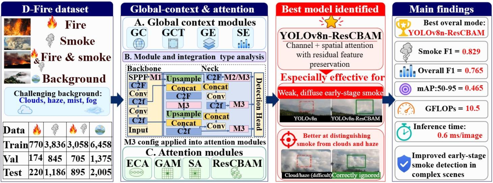
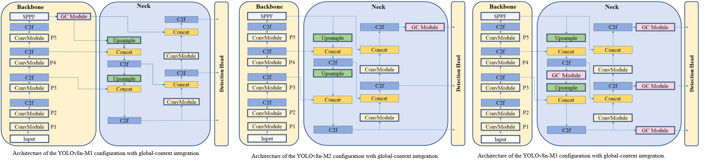
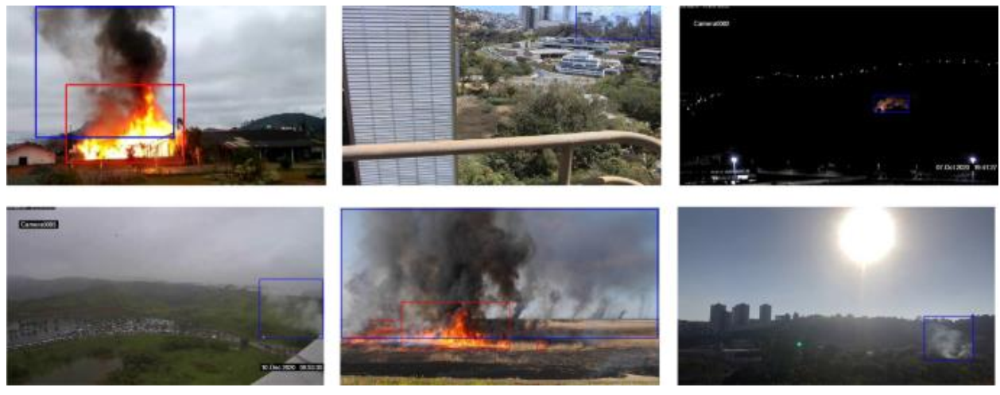

# YOLOv8n-ResCBAM for Fire and Smoke Detection

Official implementation accompanying the manuscript:

> **YOLOv8n-ResCBAM: A Lightweight Attention Network for Early Wildfire Detection Oriented to Smart City Monitoring**  
> Peiman Parisouj, Hooman Aghalou, Sayed M. Bateni, Changhyun Jun, and Essam Heggy  
> Manuscript no. `ARRAY-D-26-02892R1`, submitted to *Array*

This repository provides a controlled comparison of a vanilla YOLOv8n detector and 16 enhanced YOLOv8n configurations for fire and smoke detection:

- 12 global-context configurations: `GC`, `GCT`, `GE`, and `SE`, each evaluated with the `M1`, `M2`, and `M3` insertion strategies.
- 4 lightweight-attention configurations: `ECA`, `GAM`, `SA`, and `ResCBAM`.
- 1 vanilla YOLOv8n baseline.

The models were evaluated on the [D-Fire dataset](https://github.com/gaia-solutions-on-demand/DFireDataset), which contains 21,527 images and 26,557 annotated fire/smoke bounding boxes. YOLOv8n-ResCBAM achieved the strongest overall result in the study, with an overall F1-score of **0.765**, smoke F1-score of **0.829**, and overall mAP50-95 of **0.465**.

<!-- Replace this file with the final graphical abstract from the paper. -->
<p align="center">
  
</p>

## Contents

- [Highlights](#highlights)
- [Method overview](#method-overview)
- [Repository structure](#repository-structure)
- [Installation](#installation)
- [Dataset preparation](#dataset-preparation)
- [Model catalog](#model-catalog)
- [Training](#training)
- [Validation and test evaluation](#validation-and-test-evaluation)
- [Inference](#inference)
- [Export](#export)
- [Paper results](#paper-results)
- [Reproducing the paper protocol](#reproducing-the-paper-protocol)
- [Adding the paper figures](#adding-the-paper-figures)
- [Limitations](#limitations)
- [Citation](#citation)
- [Acknowledgments](#acknowledgments)
- [License](#license)

## Highlights

- Evaluates eight attention/context mechanisms within the same lightweight YOLOv8n framework.
- Compares three global-context insertion strategies to isolate the effect of module placement.
- Reports separate fire and smoke metrics instead of only aggregated performance.
- Improves the baseline overall F1-score from **0.736** to **0.765** with ResCBAM.
- Improves smoke recall from **0.766** to **0.814** and smoke F1-score from **0.803** to **0.829**.
- Retains a compact model size: YOLOv8n-ResCBAM has **4.239 M parameters** and **10.5 GFLOPs**.

## Method overview

The study extends YOLOv8n with four global-context mechanisms and four attention mechanisms. The global-context modules were evaluated at three different locations:

| Strategy | Placement | Purpose |
| --- | --- | --- |
| M1 | After the SPPF layer at the end of the backbone | Enrich deep semantic features before multi-scale fusion |
| M2 | After the final C2f block in the neck, immediately before detection | Reweight the final fused representation |
| M3 | After each C2f block in the neck | Apply progressive context enhancement at multiple feature scales |

The four lightweight-attention models use the multi-position M3-style neck placement selected after the global-context experiments.

<!-- Replace with the paper's architecture/insertion-strategy figure. -->
<p align="center">
  
</p>

### Modules

| Family | Module | Configuration file prefix | Short description |
| --- | --- | --- | --- |
| Global context | Global Context block | `GC` | Attention pooling and residual context transformation |
| Global context | Gaussian Context Transformer | `GCT` | Lightweight channel-context modeling and excitation |
| Global context | Gather-Excite | `GE` | Global feature gathering followed by feature excitation |
| Global context | Squeeze-and-Excitation | `SE` | Channel recalibration using squeeze and excitation |
| Attention | Efficient Channel Attention | `ECA` | Low-cost local cross-channel interaction |
| Attention | Global Attention Mechanism | `GAM` | Channel and spatial attention |
| Attention | Shuffle Attention | `SA` | Grouped channel/spatial attention with feature shuffling |
| Attention | Residual CBAM | `ResCBAM` | Residual feature preservation with channel and spatial attention |

## Repository structure

```text
Fire-and-Smoke-Detection/
|-- Attentions/
|   |-- start_train.py
|   `-- ultralytics/
|       `-- cfg/models/v8/
|           |-- yolov8.yaml
|           |-- yolov8_ECA.yaml
|           |-- yolov8_GAM.yaml
|           |-- yolov8_SA.yaml
|           `-- yolov8_ResBlock_CBAM.yaml
|-- Global_Contexts/
|   |-- start_train.py
|   `-- ultralytics/
|       `-- cfg/models/v8/
|           |-- yolov8.yaml
|           |-- yolov8_GC_M1.yaml
|           |-- yolov8_GC_M2.yaml
|           |-- yolov8_GC_M3.yaml
|           |-- yolov8_GCT_M1.yaml
|           |-- yolov8_GCT_M2.yaml
|           |-- yolov8_GCT_M3.yaml
|           |-- yolov8_GE_M1.yaml
|           |-- yolov8_GE_M2.yaml
|           |-- yolov8_GE_M3.yaml
|           |-- yolov8_SE_M1.yaml
|           |-- yolov8_SE_M2.yaml
|           `-- yolov8_SE_M3.yaml
|-- assets/                         # Add the paper figures here
|-- requirements.txt
`-- README.md
```

`Attentions/` and `Global_Contexts/` contain separate modified Ultralytics source trees. Run each command from the repository root and use the launcher belonging to the requested model family. This ensures Python imports the correct local implementation rather than an unrelated globally installed Ultralytics package.

## Installation

### 1. Clone the repository

```bash
git clone https://github.com/OWNER/REPOSITORY.git
cd REPOSITORY
```

Replace `OWNER/REPOSITORY` with this repository's final GitHub path.

### 2. Create an isolated environment

Using Conda:

```bash
conda create -n fire-smoke-yolov8 python=3.10 -y
conda activate fire-smoke-yolov8
python -m pip install --upgrade pip
```

Or using `venv`:

```bash
python -m venv .venv
```

Linux/macOS activation:

```bash
source .venv/bin/activate
```

Windows PowerShell activation:

```powershell
.\.venv\Scripts\Activate.ps1
```

### 3. Install dependencies

Install a PyTorch build suitable for your CUDA/CPU environment, then install the repository requirements:

```bash
python -m pip install -r requirements.txt
```

Verify the environment:

```bash
python -c "import torch; print('PyTorch:', torch.__version__); print('CUDA available:', torch.cuda.is_available())"
```

The bundled model code is based on Ultralytics `8.0.147`. Avoid replacing either bundled `ultralytics/` directory with a newer release unless you also port and test the custom module registrations and YAML parser changes.

## Dataset preparation

### D-Fire

Download D-Fire using the links and license information in the [official D-Fire repository](https://github.com/gaia-solutions-on-demand/DFireDataset). Annotations use normalized YOLO bounding-box coordinates. The class order is:

```yaml
0: smoke
1: fire
```

The split used in the manuscript is:

| Split | Fire-only | Smoke-only | Fire and smoke | Background | Total images |
| --- | ---: | ---: | ---: | ---: | ---: |
| Train | 770 | 3,836 | 3,058 | 6,458 | 14,122 |
| Validation | 174 | 845 | 705 | 1,375 | 3,099 |
| Test | 220 | 1,186 | 895 | 2,005 | 4,306 |
| **Total** | **1,164** | **5,867** | **4,658** | **9,838** | **21,527** |

The complete dataset contains 14,692 fire boxes and 11,865 smoke boxes. Background images should have an empty label file or no objects, according to the data loader's supported YOLO convention.

<!-- Replace with representative D-Fire samples from the manuscript. -->
<p align="center">
  
</p>

### Expected directory layout

One valid layout is:

```text
D-Fire/
|-- images/
|   |-- train/
|   |-- val/
|   `-- test/
`-- labels/
    |-- train/
    |-- val/
    `-- test/
```

Create a dataset YAML file such as `dfire.yaml`:

```yaml
# Use an absolute path, or a path relative to this YAML file.
path: /absolute/path/to/D-Fire
train: images/train
val: images/val
test: images/test

names:
  0: smoke
  1: fire
```

If your downloaded copy uses a layout such as `train/images`, `valid/images`, and `test/images`, change only the three split paths in the YAML. Do not move the dataset merely to match the example.

### Custom datasets

The same code can train on another YOLO-format detection dataset. Update `path`, `train`, `val`, `test`, and `names` in the dataset YAML. During training, Ultralytics overrides the architecture YAML's default class count with the number of classes declared by the dataset.

## Model catalog

| Model | Family | YAML path |
| --- | --- | --- |
| YOLOv8n | Baseline | `Attentions/ultralytics/cfg/models/v8/yolov8.yaml` |
| YOLOv8n-GC-M1 | Context | `Global_Contexts/ultralytics/cfg/models/v8/yolov8_GC_M1.yaml` |
| YOLOv8n-GC-M2 | Context | `Global_Contexts/ultralytics/cfg/models/v8/yolov8_GC_M2.yaml` |
| YOLOv8n-GC-M3 | Context | `Global_Contexts/ultralytics/cfg/models/v8/yolov8_GC_M3.yaml` |
| YOLOv8n-GCT-M1 | Context | `Global_Contexts/ultralytics/cfg/models/v8/yolov8_GCT_M1.yaml` |
| YOLOv8n-GCT-M2 | Context | `Global_Contexts/ultralytics/cfg/models/v8/yolov8_GCT_M2.yaml` |
| YOLOv8n-GCT-M3 | Context | `Global_Contexts/ultralytics/cfg/models/v8/yolov8_GCT_M3.yaml` |
| YOLOv8n-GE-M1 | Context | `Global_Contexts/ultralytics/cfg/models/v8/yolov8_GE_M1.yaml` |
| YOLOv8n-GE-M2 | Context | `Global_Contexts/ultralytics/cfg/models/v8/yolov8_GE_M2.yaml` |
| YOLOv8n-GE-M3 | Context | `Global_Contexts/ultralytics/cfg/models/v8/yolov8_GE_M3.yaml` |
| YOLOv8n-SE-M1 | Context | `Global_Contexts/ultralytics/cfg/models/v8/yolov8_SE_M1.yaml` |
| YOLOv8n-SE-M2 | Context | `Global_Contexts/ultralytics/cfg/models/v8/yolov8_SE_M2.yaml` |
| YOLOv8n-SE-M3 | Context | `Global_Contexts/ultralytics/cfg/models/v8/yolov8_SE_M3.yaml` |
| YOLOv8n-ECA | Attention | `Attentions/ultralytics/cfg/models/v8/yolov8_ECA.yaml` |
| YOLOv8n-GAM | Attention | `Attentions/ultralytics/cfg/models/v8/yolov8_GAM.yaml` |
| YOLOv8n-SA | Attention | `Attentions/ultralytics/cfg/models/v8/yolov8_SA.yaml` |
| YOLOv8n-ResCBAM | Attention | `Attentions/ultralytics/cfg/models/v8/yolov8_ResBlock_CBAM.yaml` |

Although the filenames do not include the `n` suffix, loading these YAMLs without another scale selects the nano (`n`) scale in the bundled implementation.

## Training

### Launcher compatibility

The complete commands below use the extended `start_train.py` interface expected by this combined repository:

```text
--model --data_dir --epochs --batch --imgsz --device --project --name
--pretrained --seed --optimizer --lr0 --momentum --weight_decay
--warmup_epochs --close_mosaic
```

Before release, confirm both launchers expose these arguments:

```bash
python ./Attentions/start_train.py --help
python ./Global_Contexts/start_train.py --help
```

The two original upstream launchers accept only `--model` and `--data_dir`. If those scripts were copied unchanged, either extend them so that they forward the options above to `model.train(...)`, or run the minimal commands and set all other values in the relevant `ultralytics/cfg/default.yaml` file.

### Common arguments

| Argument | Paper value | Meaning |
| --- | ---: | --- |
| `--data_dir` | user-defined | Path to the dataset YAML |
| `--epochs` | 150 | Maximum training epochs |
| `--batch` | 64 | Images per batch |
| `--imgsz` | 640 | Training/validation image size |
| `--device` | `0` | CUDA device; use `cpu` for CPU |
| `--project` | user-defined | Parent output directory |
| `--name` | model-specific | Run name beneath the project directory |
| `--pretrained` | `True` | Enable the repository's pretrained initialization path |
| `--seed` | 42 | Reproducibility seed used by these release commands |
| `--optimizer` | `SGD` | Optimizer used in the manuscript |
| `--lr0` | 0.01 | Initial learning rate |
| `--momentum` | 0.937 | SGD momentum |
| `--weight_decay` | 0.0005 | Weight decay |
| `--warmup_epochs` | 3.0 | Warm-up duration |
| `--close_mosaic` | 10 | Disable mosaic during the final 10 epochs |

> **Pretraining check:** when the model is created from a custom YAML, verify in the console that the intended pretrained weights are actually transferred. If your launcher only forwards `pretrained=True` but does not load a checkpoint, use its explicit weights option or call `.load("yolov8n.pt")` before training. For training from scratch, set `--pretrained False` and rename the run accordingly.

### Vanilla YOLOv8n

```bash
python ./Attentions/start_train.py --model ./Attentions/ultralytics/cfg/models/v8/yolov8.yaml --data_dir "/absolute/path/to/dfire.yaml" --epochs 150 --batch 64 --imgsz 640 --device 0 --project "./runs/train" --name "yolov8n_baseline" --pretrained True --seed 42 --optimizer SGD --lr0 0.01 --momentum 0.937 --weight_decay 0.0005 --warmup_epochs 3.0 --close_mosaic 10
```

### Global-context models: M1

M1 inserts one context module after the backbone SPPF layer.

```bash
python ./Global_Contexts/start_train.py --model ./Global_Contexts/ultralytics/cfg/models/v8/yolov8_GC_M1.yaml --data_dir "/absolute/path/to/dfire.yaml" --epochs 150 --batch 64 --imgsz 640 --device 0 --project "./runs/train" --name "yolov8n_GC_M1" --pretrained True --seed 42 --optimizer SGD --lr0 0.01 --momentum 0.937 --weight_decay 0.0005 --warmup_epochs 3.0 --close_mosaic 10
python ./Global_Contexts/start_train.py --model ./Global_Contexts/ultralytics/cfg/models/v8/yolov8_GCT_M1.yaml --data_dir "/absolute/path/to/dfire.yaml" --epochs 150 --batch 64 --imgsz 640 --device 0 --project "./runs/train" --name "yolov8n_GCT_M1" --pretrained True --seed 42 --optimizer SGD --lr0 0.01 --momentum 0.937 --weight_decay 0.0005 --warmup_epochs 3.0 --close_mosaic 10
python ./Global_Contexts/start_train.py --model ./Global_Contexts/ultralytics/cfg/models/v8/yolov8_GE_M1.yaml --data_dir "/absolute/path/to/dfire.yaml" --epochs 150 --batch 64 --imgsz 640 --device 0 --project "./runs/train" --name "yolov8n_GE_M1" --pretrained True --seed 42 --optimizer SGD --lr0 0.01 --momentum 0.937 --weight_decay 0.0005 --warmup_epochs 3.0 --close_mosaic 10
python ./Global_Contexts/start_train.py --model ./Global_Contexts/ultralytics/cfg/models/v8/yolov8_SE_M1.yaml --data_dir "/absolute/path/to/dfire.yaml" --epochs 150 --batch 64 --imgsz 640 --device 0 --project "./runs/train" --name "yolov8n_SE_M1" --pretrained True --seed 42 --optimizer SGD --lr0 0.01 --momentum 0.937 --weight_decay 0.0005 --warmup_epochs 3.0 --close_mosaic 10
```

### Global-context models: M2

M2 inserts one context module after the final C2f block in the neck.

```bash
python ./Global_Contexts/start_train.py --model ./Global_Contexts/ultralytics/cfg/models/v8/yolov8_GC_M2.yaml --data_dir "/absolute/path/to/dfire.yaml" --epochs 150 --batch 64 --imgsz 640 --device 0 --project "./runs/train" --name "yolov8n_GC_M2" --pretrained True --seed 42 --optimizer SGD --lr0 0.01 --momentum 0.937 --weight_decay 0.0005 --warmup_epochs 3.0 --close_mosaic 10
python ./Global_Contexts/start_train.py --model ./Global_Contexts/ultralytics/cfg/models/v8/yolov8_GCT_M2.yaml --data_dir "/absolute/path/to/dfire.yaml" --epochs 150 --batch 64 --imgsz 640 --device 0 --project "./runs/train" --name "yolov8n_GCT_M2" --pretrained True --seed 42 --optimizer SGD --lr0 0.01 --momentum 0.937 --weight_decay 0.0005 --warmup_epochs 3.0 --close_mosaic 10
python ./Global_Contexts/start_train.py --model ./Global_Contexts/ultralytics/cfg/models/v8/yolov8_GE_M2.yaml --data_dir "/absolute/path/to/dfire.yaml" --epochs 150 --batch 64 --imgsz 640 --device 0 --project "./runs/train" --name "yolov8n_GE_M2" --pretrained True --seed 42 --optimizer SGD --lr0 0.01 --momentum 0.937 --weight_decay 0.0005 --warmup_epochs 3.0 --close_mosaic 10
python ./Global_Contexts/start_train.py --model ./Global_Contexts/ultralytics/cfg/models/v8/yolov8_SE_M2.yaml --data_dir "/absolute/path/to/dfire.yaml" --epochs 150 --batch 64 --imgsz 640 --device 0 --project "./runs/train" --name "yolov8n_SE_M2" --pretrained True --seed 42 --optimizer SGD --lr0 0.01 --momentum 0.937 --weight_decay 0.0005 --warmup_epochs 3.0 --close_mosaic 10
```

### Global-context models: M3

M3 inserts a context module after each neck C2f block.

```bash
python ./Global_Contexts/start_train.py --model ./Global_Contexts/ultralytics/cfg/models/v8/yolov8_GC_M3.yaml --data_dir "/absolute/path/to/dfire.yaml" --epochs 150 --batch 64 --imgsz 640 --device 0 --project "./runs/train" --name "yolov8n_GC_M3" --pretrained True --seed 42 --optimizer SGD --lr0 0.01 --momentum 0.937 --weight_decay 0.0005 --warmup_epochs 3.0 --close_mosaic 10
python ./Global_Contexts/start_train.py --model ./Global_Contexts/ultralytics/cfg/models/v8/yolov8_GCT_M3.yaml --data_dir "/absolute/path/to/dfire.yaml" --epochs 150 --batch 64 --imgsz 640 --device 0 --project "./runs/train" --name "yolov8n_GCT_M3" --pretrained True --seed 42 --optimizer SGD --lr0 0.01 --momentum 0.937 --weight_decay 0.0005 --warmup_epochs 3.0 --close_mosaic 10
python ./Global_Contexts/start_train.py --model ./Global_Contexts/ultralytics/cfg/models/v8/yolov8_GE_M3.yaml --data_dir "/absolute/path/to/dfire.yaml" --epochs 150 --batch 64 --imgsz 640 --device 0 --project "./runs/train" --name "yolov8n_GE_M3" --pretrained True --seed 42 --optimizer SGD --lr0 0.01 --momentum 0.937 --weight_decay 0.0005 --warmup_epochs 3.0 --close_mosaic 10
python ./Global_Contexts/start_train.py --model ./Global_Contexts/ultralytics/cfg/models/v8/yolov8_SE_M3.yaml --data_dir "/absolute/path/to/dfire.yaml" --epochs 150 --batch 64 --imgsz 640 --device 0 --project "./runs/train" --name "yolov8n_SE_M3" --pretrained True --seed 42 --optimizer SGD --lr0 0.01 --momentum 0.937 --weight_decay 0.0005 --warmup_epochs 3.0 --close_mosaic 10
```

### Lightweight-attention models

```bash
python ./Attentions/start_train.py --model ./Attentions/ultralytics/cfg/models/v8/yolov8_ECA.yaml --data_dir "/absolute/path/to/dfire.yaml" --epochs 150 --batch 64 --imgsz 640 --device 0 --project "./runs/train" --name "yolov8n_ECA" --pretrained True --seed 42 --optimizer SGD --lr0 0.01 --momentum 0.937 --weight_decay 0.0005 --warmup_epochs 3.0 --close_mosaic 10
python ./Attentions/start_train.py --model ./Attentions/ultralytics/cfg/models/v8/yolov8_GAM.yaml --data_dir "/absolute/path/to/dfire.yaml" --epochs 150 --batch 64 --imgsz 640 --device 0 --project "./runs/train" --name "yolov8n_GAM" --pretrained True --seed 42 --optimizer SGD --lr0 0.01 --momentum 0.937 --weight_decay 0.0005 --warmup_epochs 3.0 --close_mosaic 10
python ./Attentions/start_train.py --model ./Attentions/ultralytics/cfg/models/v8/yolov8_SA.yaml --data_dir "/absolute/path/to/dfire.yaml" --epochs 150 --batch 64 --imgsz 640 --device 0 --project "./runs/train" --name "yolov8n_SA" --pretrained True --seed 42 --optimizer SGD --lr0 0.01 --momentum 0.937 --weight_decay 0.0005 --warmup_epochs 3.0 --close_mosaic 10
python ./Attentions/start_train.py --model ./Attentions/ultralytics/cfg/models/v8/yolov8_ResBlock_CBAM.yaml --data_dir "/absolute/path/to/dfire.yaml" --epochs 150 --batch 64 --imgsz 640 --device 0 --project "./runs/train" --name "yolov8n_ResCBAM" --pretrained True --seed 42 --optimizer SGD --lr0 0.01 --momentum 0.937 --weight_decay 0.0005 --warmup_epochs 3.0 --close_mosaic 10
```

### Minimal commands for an unchanged upstream launcher

```bash
# Context example
python ./Global_Contexts/start_train.py --model ./Global_Contexts/ultralytics/cfg/models/v8/yolov8_GC_M1.yaml --data_dir "/absolute/path/to/dfire.yaml"

# Attention example
python ./Attentions/start_train.py --model ./Attentions/ultralytics/cfg/models/v8/yolov8_ResBlock_CBAM.yaml --data_dir "/absolute/path/to/dfire.yaml"
```

With the minimal interface, edit the correct family's `ultralytics/cfg/default.yaml` before training. Do not assume that editing one source tree changes the other.

### Resume an interrupted run

Use the correct model-family source tree so the custom classes can be imported from the checkpoint:

```bash
cd Attentions
python -c "from ultralytics import YOLO; YOLO(r'../runs/train/yolov8n_ResCBAM/weights/last.pt').train(resume=True)"
cd ..
```

For a global-context checkpoint, replace `Attentions` with `Global_Contexts` and update the checkpoint path.

## Validation and test evaluation

Ultralytics saves the best checkpoint as:

```text
runs/train/<RUN_NAME>/weights/best.pt
```

Evaluate an attention-model checkpoint on the dataset's test split:

```bash
cd Attentions
python -c "from ultralytics import YOLO; YOLO(r'../runs/train/yolov8n_ResCBAM/weights/best.pt').val(data=r'/absolute/path/to/dfire.yaml', split='test', imgsz=640, batch=64, device=0, iou=0.7, project=r'../runs/test', name='yolov8n_ResCBAM')"
cd ..
```

Evaluate a global-context checkpoint:

```bash
cd Global_Contexts
python -c "from ultralytics import YOLO; YOLO(r'../runs/train/yolov8n_GC_M3/weights/best.pt').val(data=r'/absolute/path/to/dfire.yaml', split='test', imgsz=640, batch=64, device=0, iou=0.7, project=r'../runs/test', name='yolov8n_GC_M3')"
cd ..
```

In the paper, `iou=0.7` is the NMS overlap threshold used during validation; it is not the single IoU threshold used to declare all true positives. The reported mAP50-95 integrates AP over IoU thresholds from 0.50 to 0.95.

## Inference

`source` may be a single image, directory, video, webcam index, or supported stream URL.

### YOLOv8n-ResCBAM or another attention checkpoint

```bash
cd Attentions
python -c "from ultralytics import YOLO; YOLO(r'../runs/train/yolov8n_ResCBAM/weights/best.pt').predict(source=r'/absolute/path/to/images-or-video', imgsz=640, conf=0.25, iou=0.7, device=0, save=True, project=r'../runs/predict', name='rescbam_predictions')"
cd ..
```

### GC/GCT/GE/SE checkpoint

```bash
cd Global_Contexts
python -c "from ultralytics import YOLO; YOLO(r'../runs/train/yolov8n_GC_M3/weights/best.pt').predict(source=r'/absolute/path/to/images-or-video', imgsz=640, conf=0.25, iou=0.7, device=0, save=True, project=r'../runs/predict', name='gc_m3_predictions')"
cd ..
```

Useful prediction arguments:

| Argument | Example | Description |
| --- | --- | --- |
| `source` | `image.jpg`, `images/`, `video.mp4`, `0` | Input source |
| `conf` | `0.25` | Confidence threshold; tune for the deployment operating point |
| `iou` | `0.7` | NMS IoU threshold |
| `device` | `0`, `0,1`, or `cpu` | Compute device |
| `save` | `True` | Save annotated outputs |
| `save_txt` | `True` | Optionally save YOLO-format predictions |
| `save_conf` | `True` | Include confidence values in saved text predictions |

For CPU inference, change `device=0` to `device='cpu'`.

### Python API

Run the script from inside the source tree corresponding to the checkpoint:

```python
from ultralytics import YOLO

model = YOLO("../runs/train/yolov8n_ResCBAM/weights/best.pt")
results = model.predict(
    source="/absolute/path/to/image.jpg",
    imgsz=640,
    conf=0.25,
    iou=0.7,
    device=0,
    save=True,
)

for result in results:
    print(result.boxes)
```

## Export

Export an attention checkpoint to ONNX:

```bash
cd Attentions
python -c "from ultralytics import YOLO; YOLO(r'../runs/train/yolov8n_ResCBAM/weights/best.pt').export(format='onnx', imgsz=640, opset=12, simplify=True)"
cd ..
```

For a context checkpoint, run the same command from `Global_Contexts/`. Other export targets supported by the bundled Ultralytics version may include TorchScript, OpenVINO, TensorRT, CoreML, TensorFlow SavedModel, TFLite, and TF.js. Export support depends on the custom module and installed backend; validate numerical parity and runtime behavior before deployment.

## Paper results

All results below are from the isolated D-Fire test partition described in the manuscript. `P`, `R`, and `F1` are reported separately for all classes, smoke, and fire.

| Model | Overall P | Overall R | Overall F1 | Smoke P | Smoke R | Smoke F1 | Fire P | Fire R | Fire F1 | Params (M) | GFLOPs | ms/image |
| --- | ---: | ---: | ---: | ---: | ---: | ---: | ---: | ---: | ---: | ---: | ---: | ---: |
| YOLOv8n | 0.769 | 0.705 | 0.736 | 0.843 | 0.766 | 0.803 | 0.696 | 0.643 | 0.668 | 3.006 | 8.1 | 0.5 |
| YOLOv8n-GC-M1 | 0.773 | 0.717 | 0.744 | 0.834 | 0.782 | 0.807 | 0.711 | 0.652 | 0.680 | 3.056 | 8.2 | 0.5 |
| YOLOv8n-GC-M2 | 0.777 | 0.717 | 0.746 | 0.832 | 0.787 | 0.809 | 0.723 | 0.647 | 0.683 | 3.020 | 8.1 | 0.6 |
| **YOLOv8n-GC-M3** | **0.797** | 0.712 | **0.752** | 0.848 | 0.778 | 0.811 | 0.747 | 0.646 | 0.693 | 3.033 | 8.1 | 0.6 |
| YOLOv8n-GCT-M1 | 0.764 | 0.694 | 0.727 | 0.821 | 0.763 | 0.791 | 0.708 | 0.626 | 0.664 | 3.039 | 8.2 | 0.5 |
| YOLOv8n-GCT-M2 | 0.778 | 0.701 | 0.737 | 0.830 | 0.760 | 0.793 | 0.725 | 0.641 | 0.680 | 3.006 | 8.1 | 0.6 |
| YOLOv8n-GCT-M3 | 0.761 | 0.643 | 0.697 | 0.787 | 0.721 | 0.753 | 0.735 | 0.565 | 0.639 | 3.006 | 8.1 | 0.6 |
| YOLOv8n-GE-M1 | 0.786 | 0.711 | 0.747 | 0.844 | 0.776 | 0.809 | 0.728 | 0.646 | 0.685 | 3.044 | 8.2 | 0.6 |
| YOLOv8n-GE-M2 | 0.777 | 0.716 | 0.745 | 0.838 | 0.780 | 0.808 | 0.716 | 0.652 | 0.683 | 3.012 | 8.1 | 0.6 |
| YOLOv8n-GE-M3 | 0.795 | 0.705 | 0.747 | 0.850 | 0.769 | 0.807 | 0.741 | 0.640 | 0.687 | 3.019 | 8.1 | 0.5 |
| YOLOv8n-SE-M1 | 0.778 | 0.707 | 0.741 | 0.828 | 0.769 | 0.797 | 0.727 | 0.646 | 0.684 | 3.047 | 8.2 | 0.5 |
| YOLOv8n-SE-M2 | 0.789 | 0.703 | 0.744 | 0.836 | 0.770 | 0.802 | 0.742 | 0.635 | 0.684 | 3.015 | 8.1 | 0.5 |
| YOLOv8n-SE-M3 | 0.780 | 0.713 | 0.745 | 0.838 | 0.777 | 0.806 | 0.721 | 0.649 | 0.683 | 3.019 | 8.1 | 0.5 |
| YOLOv8n-ECA | 0.799 | 0.731 | 0.763 | 0.853 | 0.799 | 0.825 | 0.746 | 0.663 | **0.702** | 3.006 | 8.1 | 0.6 |
| YOLOv8n-GAM | **0.800** | 0.724 | 0.760 | **0.852** | 0.803 | 0.827 | **0.749** | 0.646 | 0.694 | 3.687 | 9.5 | 0.7 |
| YOLOv8n-SA | 0.789 | 0.731 | 0.759 | 0.834 | 0.808 | 0.821 | 0.744 | 0.653 | 0.696 | 3.006 | 8.1 | 0.6 |
| **YOLOv8n-ResCBAM** | 0.793 | **0.739** | **0.765** | 0.845 | **0.814** | **0.829** | 0.741 | **0.663** | 0.700 | 4.239 | 10.5 | 0.6 |

Headline mAP results:

| Model/category | mAP50 | mAP50-95 |
| --- | ---: | ---: |
| YOLOv8n, overall | 0.746 | 0.426 |
| YOLOv8n-ResCBAM, overall | approximately 0.790 | **0.465** |
| YOLOv8n-ResCBAM, smoke | not shown here | **0.543** |
| YOLOv8n-ECA, fire | not shown here | **0.391** |

Relative to vanilla YOLOv8n, ResCBAM improved overall F1 by 3.94%, overall mAP50 by 5.89%, and overall mAP50-95 by 9.15%. ECA produced the strongest fire F1-score in the attention comparison.

Inference times are hardware- and software-dependent. The values above were measured under the paper's experimental environment and should not be treated as deployment guarantees.

<!-- Replace with the paper's quantitative comparison figure. -->
<p align="center">
  
</p>

<!-- Replace with the paper's qualitative baseline-versus-ResCBAM detections. -->
<p align="center">
  
</p>

## Reproducing the paper protocol

Use the following settings for the closest reproduction of the manuscript experiments:

| Item | Setting |
| --- | --- |
| Input resolution | 640 x 640 with YOLO letterbox resizing |
| Epochs | 150 |
| Batch size | 64 |
| Optimizer | SGD |
| Initial learning rate | 0.01 |
| Momentum | 0.937 |
| Weight decay | 0.0005 |
| Warm-up | Epochs 0-3, increasing from near zero to 0.01 |
| Augmentation | Bundled/default YOLOv8 HSV, translation, scaling, horizontal flip, and mosaic |
| Mosaic | Disabled for final 10 epochs |
| Validation NMS IoU | 0.7 |
| Training/testing hardware | NVIDIA V100 SXM2 16 GB and Intel Gold 6148 2.4 GHz |

For a fair comparison:

1. Keep the D-Fire test split isolated until all model and threshold decisions are frozen.
2. Use the same train/validation/test manifests for every configuration.
3. Keep augmentation, optimizer, image size, batch size, and stopping policy identical across models.
4. Record the exact repository commit, Python/PyTorch/CUDA versions, seed, and transferred pretrained layers.
5. Report both overall and class-specific metrics because a change can help smoke detection without producing the same gain for fire.

The manuscript reports one training seed. Small score differences may occur across hardware, CUDA/cuDNN versions, dependency versions, and nondeterministic GPU operations.

## Adding the paper figures

Create an `assets/` directory and add the final publication-quality figures using these filenames, or change the references in this README:

| README location | Expected file | Suggested paper content |
| --- | --- | --- |
| Top of README | `assets/graphical_abstract.png` | Graphical abstract |
| Method overview | `assets/architecture_and_insertion_strategies.png` | YOLOv8n and M1/M2/M3 architecture diagrams |
| Dataset section | `assets/dfire_examples.png` | Representative D-Fire samples and labels |
| Results section | `assets/performance_comparison.png` | Overall/class-specific metric comparison |
| Results section | `assets/qualitative_comparison.png` | Ground truth, vanilla predictions, and ResCBAM predictions |

Optional additional figures:

```markdown


```

Recommended image guidance:

- Use PNG for plots, diagrams, and screenshots with text; use high-quality JPEG only for photographic grids.
- Crop excess white margins before committing.
- Keep text readable at GitHub's default content width.
- Do not include copyrighted figures from third-party papers without permission.
- Add a short, descriptive `alt` value for accessibility.

## Limitations

- Evaluation was performed on D-Fire only; cross-dataset generalization remains unverified.
- The study reports a single training seed, so uncertainty across repeated runs was not measured.
- Source-scene and video-group identifiers were unavailable; the split was therefore handled at image level.
- Cloud, fog, and haze are not separate labeled classes in D-Fire, limiting class-specific analysis of atmospheric false positives.
- The reported speed was measured on a V100-class GPU; edge-device latency, energy use, and memory behavior require dedicated benchmarking.
- The released models process individual frames and do not exploit temporal video information.

## Troubleshooting

### `ModuleNotFoundError` for a custom attention/context class

Run from the correct subdirectory or use its launcher. A checkpoint trained with `Attentions/` should be loaded while that directory is the active local package; a context checkpoint should be loaded from `Global_Contexts/`.

### A newer installed `ultralytics` package is imported

Check the import path:

```bash
cd Attentions
python -c "import ultralytics; print(ultralytics.__version__); print(ultralytics.__file__)"
cd ..
```

The path should point inside this repository, and the bundled version should report `8.0.147`.

### CUDA out of memory

Reduce `--batch` first. If necessary, reduce `--imgsz`, but note that changing the image size no longer reproduces the paper protocol.

### Dataset not found or labels not detected

Use an absolute dataset root in the YAML, verify that every image split has the matching label directory, and confirm that labels follow `class x_center y_center width height` with normalized coordinates.

### Existing run directory causes an automatic name suffix

Choose a new `--name`, remove/relocate the previous run intentionally, or enable overwrite behavior only if your launcher exposes it and you understand the consequences.

## Citation

The manuscript is under review. Update the journal metadata, DOI, volume, issue, and article number after publication.

```bibtex
@article{parisouj2026yolov8nrescbam,
  title   = {YOLOv8n-ResCBAM: A Lightweight Attention Network for Early Wildfire Detection Oriented to Smart City Monitoring},
  author  = {Parisouj, Peiman and Aghalou, Hooman and Bateni, Sayed M. and Jun, Changhyun and Heggy, Essam},
  journal = {Array},
  year    = {2026},
  note    = {Manuscript under review}
}
```

If you use D-Fire, also cite the dataset authors as requested by the [D-Fire project](https://github.com/gaia-solutions-on-demand/DFireDataset).

## Acknowledgments

This implementation adapts module definitions and configuration patterns from:

- [FCE-YOLOv8](https://github.com/RuiyangJu/FCE-YOLOv8), used for the GC, GCT, GE, and SE context modules and M1/M2/M3 configurations.
- [Fracture Detection Improved YOLOv8](https://github.com/RuiyangJu/Fracture_Detection_Improved_YOLOv8), used for the ECA, GAM, SA, and ResCBAM attention modules.
- [Ultralytics YOLOv8](https://github.com/ultralytics/ultralytics), which provides the base detection framework.
- [D-Fire](https://github.com/gaia-solutions-on-demand/DFireDataset), which provides the fire and smoke dataset used in the study.

Please cite the relevant upstream publications when using the corresponding implementations.

## Funding

This research was supported by NSF grant no. 2431050 awarded to the University of Hawai'i at Manoa.

## License

The two upstream module repositories are distributed under the MIT License, while files in the bundled Ultralytics source trees contain AGPL-3.0 license notices. D-Fire is distributed under its own dataset license. Before public release, add a top-level `LICENSE` file and preserve all applicable upstream copyright and license notices.

